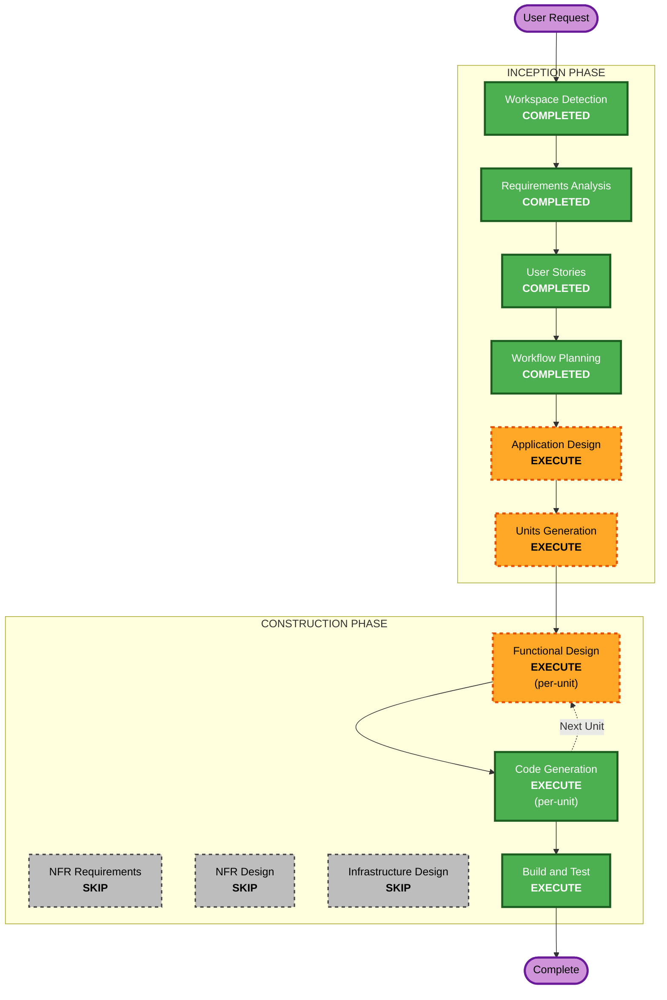

# Execution Plan - MindEcho

## Detailed Analysis Summary

### Change Impact Assessment
- **User-facing changes**: Yes — 全機能がユーザー向け新規機能（Webアプリケーション全体）
- **Structural changes**: Yes — フルスタック新規構築（Frontend + Backend + AI/ML + DB + Storage）
- **Data model changes**: Yes — ユーザー、メディア、感情履歴、生成文章のスキーマ設計が必要
- **API changes**: Yes — REST APIの新規設計（認証、メディア、解析、生成）
- **NFR impact**: Yes — パフォーマンス（解析/生成レスポンス）、セキュリティ（認証、ファイルアップロード）

### Risk Assessment
- **Risk Level**: Medium
- **Rollback Complexity**: Easy（Greenfield、既存システムへの影響なし）
- **Testing Complexity**: Moderate（AI/ML統合テスト、マルチメディア対応）

---

## Workflow Visualization



### Text Alternative
```
Phase 1: INCEPTION
  - Workspace Detection (COMPLETED)
  - Requirements Analysis (COMPLETED)
  - User Stories (COMPLETED)
  - Workflow Planning (COMPLETED)
  - Application Design (EXECUTE)
  - Units Generation (EXECUTE)

Phase 2: CONSTRUCTION (per-unit loop)
  - Functional Design (EXECUTE, per-unit)
  - NFR Requirements (SKIP)
  - NFR Design (SKIP)
  - Infrastructure Design (SKIP)
  - Code Generation (EXECUTE, per-unit)
  - Build and Test (EXECUTE)

Phase 3: OPERATIONS
  - Operations (PLACEHOLDER)
```

---

## Phases to Execute

### INCEPTION PHASE
- [x] Workspace Detection (COMPLETED)
- [x] Requirements Analysis (COMPLETED)
- [x] User Stories (COMPLETED)
- [x] Workflow Planning (COMPLETED)
- [ ] Application Design - **EXECUTE**
  - **Rationale**: 新規プロジェクトで5ユニット構成（Unit 0〜4）のコンポーネント設計、メソッド定義、サービス間依存関係の明確化が必要
- [ ] Units Generation - **EXECUTE**
  - **Rationale**: 5ユニットの実装順序、依存関係、データフローの定義が必要。Initial Conceptで定義済みのUnit分解を正式化する

### CONSTRUCTION PHASE (per-unit loop)
- [ ] Functional Design - **EXECUTE** (per-unit)
  - **Rationale**: 各ユニットにデータモデル、ビジネスロジック、API設計が含まれるため詳細設計が必要
- [ ] NFR Requirements - **SKIP**
  - **Rationale**: PoC規模（~100ユーザー）のため、要件定義で記載済みのNFR（NFR-1〜6）で十分。専用フェーズは不要
- [ ] NFR Design - **SKIP**
  - **Rationale**: NFR Requirementsをスキップするため
- [ ] Infrastructure Design - **SKIP**
  - **Rationale**: PoC段階ではAWS Lambda + API Gateway等のシンプル構成で十分。Code Generationフェーズ内でインフラ定義を行う
- [ ] Code Generation - **EXECUTE** (per-unit, ALWAYS)
  - **Rationale**: 実装コードの生成が必要
- [ ] Build and Test - **EXECUTE** (ALWAYS)
  - **Rationale**: ビルド・テスト手順の作成が必要

### OPERATIONS PHASE
- [ ] Operations - PLACEHOLDER

---

## Unit Execution Order

Initial Conceptと要件定義に基づく推奨実装順序:

| 順序 | Unit | 理由 |
|---|---|---|
| 1 | Unit 0: Auth & Core Infrastructure | 他の全ユニットが依存する認証・DB・API基盤 |
| 2 | Unit 1: Media Analysis Unit | メディアアップロードと解析パイプラインの構築 |
| 3 | Unit 2: Cognitive Mapping Unit | 解析結果に基づくコンテクスト設問・感情選択肢の生成 |
| 4 | Unit 3: Sentence Synthesis Unit | 文章生成の中核機能 |
| 5 | Frontend Integration | 全ユニットを統合するNext.jsフロントエンド |

※ Unit 4 (User Persona Tuning) はMVPスコープ外

---

## Success Criteria
- **Primary Goal**: MindEchoのMVP完成（画像・音楽・漫画・小説の4メディア対応、感情言語化→文章生成→SNS共有）
- **Key Deliverables**:
  - Next.js フロントエンドアプリケーション
  - FastAPI バックエンドAPI
  - AWS Bedrock統合によるメディア解析・文章生成
  - PostgreSQL データベーススキーマ
  - JWT認証システム
- **Quality Gates**:
  - 全21ユーザーストーリーのMust Have（15件）が実装されていること
  - 各ユニットの単体テストが通過すること
  - E2Eフロー（アップロード→設問→感情選択→生成→共有）が動作すること
